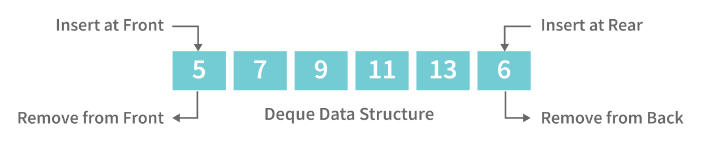

# Абстрактные структуры данных

**Stack** -- абстрактный тип данных, представляющий собой контейнер, организующий элементы
по принципу LIFO (Last In First Out).

В этой структуре данных поддерживаются простейшие действия такие как:
`push` (положить на вершину стека), `pop` (удалить с вершины стека),
`top` (посмотреть на вершину стека). Все они имеют алг. сложность $O(1)$.

Стек используется во множестве алгоритмов (пр. Shunting Yard для разбора выражений) и
реализован аппаратно в процессорах для поддержки возврата из функций и расположении
временных (локальных) переменных.


**Queue** -- абстрактный тип данных, представляющий собой контейнер, организующий элементы
по принципу FIFO (First In First Out).

В этой структуре данных поддерживаются простейшие действия такие как:
`push` (вставить в конец очереди), `pop` (удалить с начала очереди),
`front` (посмотреть на начало очереди). Все они имеют алг. сложность $O(1)$.


**Deque** -- абстрактный тип данных, обобщающий очередь, для которой доступны
операции вставки, удаления и доступа к элементов с двух концов.
Все операции по-прежнему имеют сложность $O(1)$.



Для реализации очереди и двусторонней очереди следует использовать **кольцевой массив**.

**Кольцевой буфер** -- это структура данных, использующая линейный буфер (массив)
фиксированной длинны, у которой начало соединено с концом.


С помощью кольцевого буфера можно эффективно реализовать очередь, добиваясь
сложности удаления элемента за $O(1)$, не перемещая за $O(n)$ элементы так, чтобы
в массиве первый элемент был началом очереди.


## Задание

Вам необходимо решить задачу вашего варианта, написав реализацию структуры данных
по вашему варианту, ориентируясь на прототипы функций и структур в соответствующих
заголовочных файлах, а также написать реализацию и тесты для "вспомогательной процедуры"
в файле `main.c`.

Свой вариант можно найти в [таблице результатов](https://disk.yandex.ru/i/6A-2bVOjMskp4g),
во вкладке "Варианты".

### Уточнения по реализации

Элементы структуры данных отображаются на массив, но массив не бесконечен, поэтому,
как только количество элементов станет равно (превысит) вместимости массива, его следует
увеличить вдвое.

В заголовочном файле Вашей структуры данных следует изменить тип `T` на тот, что указан
в варианте. Это единственное место в API, которое Вам разрешено изменять.

Результатом сортировки стека должно быть расположение элементов в порядке убывания,
то есть на вершине стека находится наибольший элемент, а на дне -- наименьший.

Результатом сортировки очереди и двусторонней очереди должно быть расположение
элементов в порядке возрастания, то есть в начале очереди находится наименьший элемент,
а в конце -- наибольший.

Печать стека должна быть реализована так, чтобы первым был напечатан элемент на
вершине стека и далее за ним в порядке вытаскивания элементов. Для очередей это исключение
не действует.

Разрешается реализовывать _рекурсивные_ алгоритмы.

## Варианты

### Структура данных

1. Stack
2. Queue
3. Deque

### Тип элементов структуры данных

1. Целый (`int32_t`)
2. Вещественный (`double`)
3. Символьный (`char`)

### Вспомогательная процедура и сортировка

1. Поиск и удаление максимального (для стека и дека) или минимального (для очереди) элемента / сортировка выбором (Selection sort)
2. Вставка элемента в структуру данных, упорядоченные по возрастанию, с сохранением порядка / сортировка вставкой (Insertion sort)
3. Конкатенация двух структур данных / быстрая сортировка Хоара (Quicksort)
4. Поиск в структуре данных двух элементов, идущих подряд, первый из которых больше второго. Если такие элементы найдены, то переставить их / сортировка пузырьком (Bubble sort)
5. Слияние двух структур данных, упорядоченных по возрастанию, с сохранением порядка / сортировка слиянием (Merge sort)
6. Поиск в структуре данных первого от начала элемента, который меньше своего непосредственного предшественника.
Если такой элемент найден, то следует сместить его к началу до тех пор, пока он не станет
первым или больше своего предшественника / сортировка вставкой (Insertion sort)

## Тестирование

В этой лабораторной работе присутствует автоматическое _юнит-тестирование_.
Это значит, что работоспособность функционала, все реализованные Вами функции,
будут протестированы на общих юнит-тестах и Вашем кастомном тесте.

Если у Вас есть предложения по улучшению тестов или большему ими покрытию
функционала, напишите админу, он будет очень рад!

Свой тест следует написать в файле `main.c` в специально отведенном для этого месте.
Вы увидите комментарии, будет объяснено, что и как делать.

Ваше решение будет компилироваться следующей командой:

```sh
gcc -std=c99 -g -O0 -Wall -Wextra -Werror -Wdeclaration-after-statement -fsanitize=address,leak,undefined ... main.c && ./a.out
```

Замените `...` на один из `stack.c`, `queue.c` или `deque.c`, файлов реализации Вашей
структуры данных.

Прежде чем пушить решение в репозиторий, рекомендуется запустить эту команду и проверить,
что все тесты проходятся успешно, иначе работа на Code Review проверяться **не будет**.

**Очень** рекомендуется компилировать и запускать _локально_, без применения для этого
веб-сервисов.

## Важные требования к решению

Чтобы работа была засчитана, необходимо удовлетворять следующим критериям:
- Код должен быть понятным, названия переменных отражают то, что они хранят;
- Запрещается изменять API `stack.h`, `queue.h` и `deque.h`,
кроме типа данных, которые они будут хранить, а также общие юнит-тесты в `main.c`;
- Должен быть реализован весь API;
- Запрещается использовать сторонние библиотеки, кроме стандартной;
- Разрешается использовать только _динамические массивы_.
- Запрещается работать с массивом напрямую при реализации сортировки и вспомогательной
процедуры. Предполагается, что все операции, которые были реализованы для структуры данных, достаточны.
